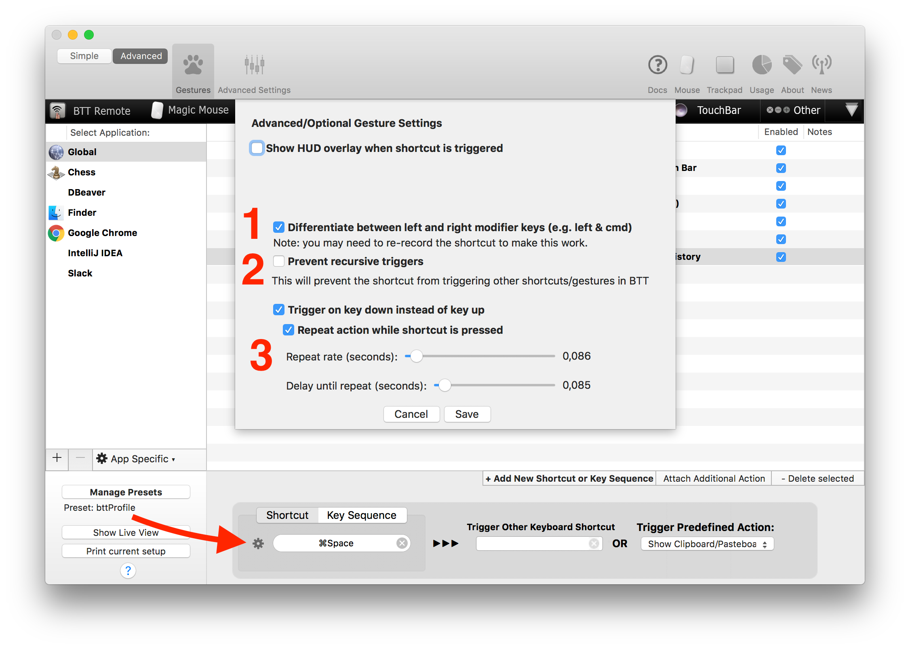

# Advanced Shortcut Settings

For most use cases recording a shortcut is simple and straight forward. However if you want to enable things like key-repeat or differentiate between left/right modifier keys, you need to open the advanced Keyboard Shortcut Configuration.

To open the advanced keyboard configuration screen, click the little cog icon on the left side of the shortcut field:

Now you have different options.

## HUD Overlay
You can make BetterTouchTool display a little HUD overlay (like e.g. the ones that show up when changing the volume or brightness on your Mac.). This works the same as for Gestures in BTT.

## Differentiate between left and right modifier keys
Recent versions of BetterTouchTool can differentiate between left and right modifier keys on your keyboard.

By default if you record a shortcut, it works for both, the left and the right modifier keys. E.g. if you record cmd+space it would not matter whether you press the left cmd key and the space key or the right cmd key and the space key.

By checking the checkbox 1 (in the screenshot above), you can enable BTT to differentiate between them. This can be very useful and gives you many more shortcut options. For example, cmd+space usually triggers Spotlight on macOS. However you probably always trigger it with the left (or right) cmd key. Now wouldn't it be useful if you could set the right cmd + space to some other action?

## Trigger on key-down / key up
BetterTouchTool allows you to select whether you want a shortcut to trigger on key down or on key up. This can be useful if you want to e.g. trigger one action on key down (e.g. middle-mouse down using the custom click predefined action) and another action on key up (e.g. middle-mouse up).

In such a case you would just configure two shortcuts with the same keys. Then you would check the "Trigger on down" checkbox for one of them.

## Key Repeat
By default BetterTouchTool only triggers the action you assign to a keyboard shortcut once. However you can also configure it to trigger repeatedly while holding down the shortcut.

If you want to do this, you need to check the "Trigger on key-down" checkbox and the "Repeat action" checkbox. Then you can use the sliders to choose the key repeat rate and the delay after which the first repeat should happen.

## Prevent recursive triggers
There is one more checkbox in the settings, and it's called "prevent recursive triggers".

By default you can have multiple shortcuts defined in BTT. E.g. "cmd+a" and "cmd+b". Now if you assign an action or shortcut to the cmd+a shortcut, which again triggers cmd+a for some reason this would cause an endless loop because BetterTouchTool would catch&trigger that shortcut again and again.
To prevent this, you can check the "prevent recursive triggers" checkbox.
