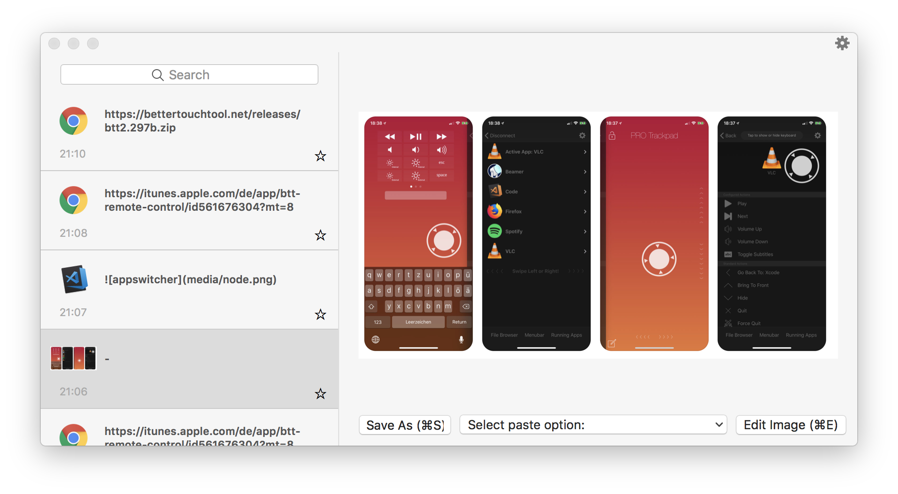

#Clipboard Manager

BetterTouchTool integrates a nice little clipboard manager. You can activate it by assigning the predefined action "Show Clipboard/Pasteboard History".

The clipboard manager also integrates a little screenshot editor.

