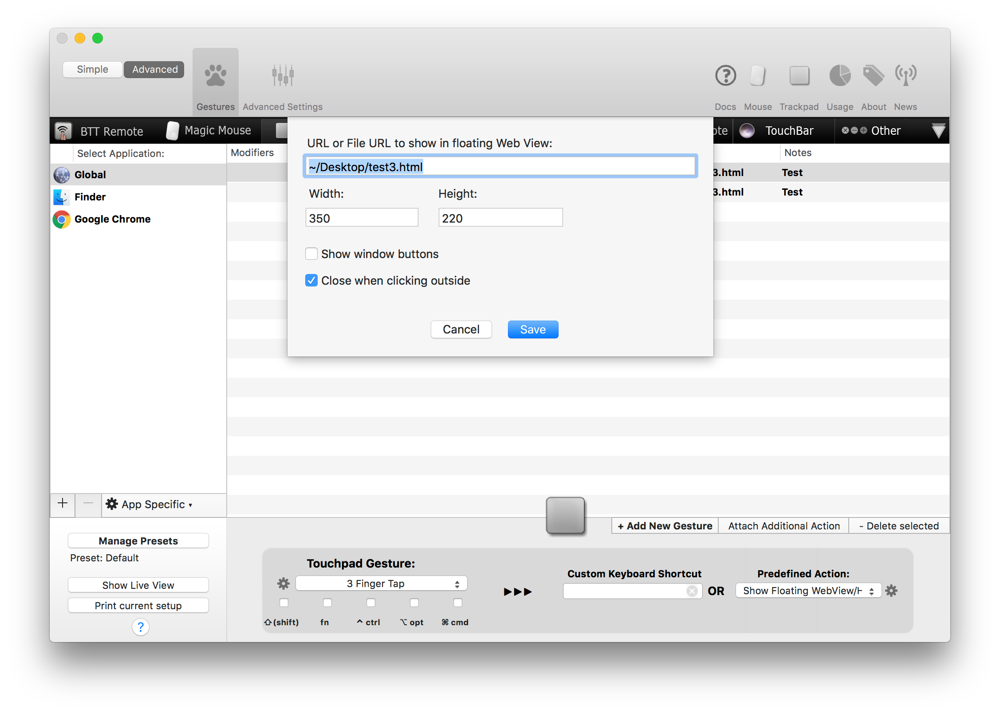
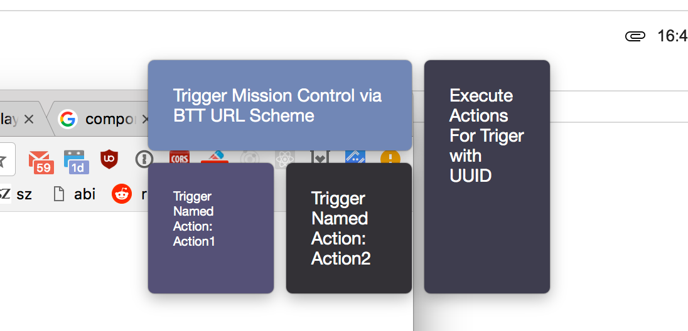

# Floating WebView/HTML Menu
This is a very recent feature which is only available in **versions greater than 2.430**. 

There is now also a little tutorial available here: [https://folivora.ai/blog/post/13000](https://folivora.ai/blog/post/13000)

Using the predefined action "Show Floating WebView/HTML Menu" you can bring up a completely customizable overlay menu, which can control all of your BetterTouchTool actions.


## Setup
The setup is pretty simple. You assign the predefined action "Show Floating WebView/HTML Menu" to some trigger in BTT.
You enter the path or URL to the html file you want to show.

**Available Settings**
* Width & Height define how big the overlay will be.
* "*Show window buttons*" defines whether the red/orange/green window buttons are shown above the overlay menu.
* You can choose whether the menu should close when clicking outside or not.


**Triggering BetterTouchTool actions**

This feature only really makes sense when combined with the new scripting possibilities of BetterTouchTool.
You can read more about them here: [Scripting BetterTouchTool](scripting_btt.md)

In the example below I show two different ways how to trigger BetterTouchTool actions from the menu.
* [Via the custom btt:// URL Scheme](custom_url_scheme.md)
* [Via BetterTouchTool's integrated webserver](webserver.md)

The custom URL scheme has the limitation, that it can not return any data back to the menu. When you use the webserver instead you can e.g. trigger shell or Apple Scripts in BetterTouchTool that return a value. You can then display that value anywhere in your HTML.

## Closing the menu
To close the menu  perform the same trigger you used to open the menu again.

If you want to close the menu in response to any of your menu items, include 
 ```&closeFloatingHTMLMenu=1``` in your url.

 ## Executing Java Script when the Menu opens
 BetterTouchTool automatically calls the BTTInitialize() method, you can implement it with your custom code.

  ## Executing Java Script when the Menu closes
 BetterTouchTool automatically calls the BTTWillCloseWindow() method when the overlay is about to close, you can implement it with your custom code.

## Tips for creating a menu
* Use CSS Grid, as it makes it easy to position elements in a grid.
* Test in a web browser first (just open your html file). It's easier to debug there.
* If you made a change after having the menu opened in BTT, you can right-click the menu and choose "reload".

## Example Menu

Link to live example [https://docs.bettertouchtool.net/example.html](https://docs.bettertouchtool.net/example.html)





Before I show you the code of the menu in the screenshot, have a look at this very basic example. It just contains two links that use the custom url scheme to trigger actions configured within BTT.

```HTML
<a href="btt://execute_assigned_actions_for_trigger/?uuid=AD129A1F-4E24-413F-817D-258EEE6D9353&closeFloatingHTMLMenu=1">
    Trigger Action with UUID
</a>
<a href="btt://execute_assigned_actions_for_trigger/?uuid=E42516FA-13F4-312F-916F-25FFEAG41213&closeFloatingHTMLMenu=1">
    Trigger Action with another UUID
</a>

```

And here is the code of the above example. It uses Java Script fetch to trigger actions and return their results (if any).

Also it makes use of named triggers (which are available in the "Other" tab in BetterTouchTool. ). They are really useful when creating such menus.

```HTML

<html>
<head>
    <script>         
        // this is just a very basic example on how to trigger a named action in BTT.
        // Named actions allow to get the return value if they were running an Apple Script or Shell Script 
        // in response.
        window.serverAddress = 'http://127.0.0.1:50637';
        window.sharedSecret = 'test'; //if you have set a shared secret in BTT.

        function fetchURLAndAssignResultToElement(url, elementID) {
            // we just make a fetch request to the BTT webserver
            fetch(url + '&shared_secret=' + window.sharedSecret)
                .then(response => response.text())
                .then(text => {
                    if (text && text.length > 0) {
                        var elementToReplaceHTML = document.getElementById(elementID);
                        elementToReplaceHTML.innerHTML = text;
                    }
                });
        }

        function trigger_named_trigger(namedActionName, assignResultToElementWithID, closeMenu) {
            // you can trigger any BTT action with the correct definition. This will trigger
            // a named action (which can be configured in the other tab).
            var namedAction = {
                "BTTPredefinedActionType": 248,
                "BTTPredefinedActionName": "Trigger Named Trigger (Configured in Other Tab)",
                "BTTNamedTriggerToTrigger": namedActionName
            }

            var url = window.serverAddress + '/trigger_action/?json=' + JSON.stringify(namedAction);
            if(closeMenu === true) {
                url += '&closeFloatingHTMLMenu=1';
            }
            // we just make a fetch request to the BTT webserver
            fetchURLAndAssignResultToElement(url, assignResultToElementWithID);
        }

        function execute_assigned_actions_for_trigger(uuid, assignResultToElementWithID) {
            var url = window.serverAddress + '/execute_assigned_actions_for_trigger/?uuid=' + uuid;
            

            // we just make a fetch request to the BTT webserver
            fetchURLAndAssignResultToElement(url, assignResultToElementWithID);
        }
    </script>

    <style>
        body {
            background-color: clear;
            font-family: HelveticaNeue;
            font-size: 0.6em
        }

        .wrapper {
            display: grid;
            grid-gap: 10px;
            grid-template-columns: 100px 100px 100px;
        }

        .box {
            color: #fff;
            border-radius: 5px;
            padding: 20px;
            font-size: 150%;
        }

        .box:hover {
            background: #eb7b13;
        }

        .a {
            background: rgb(113, 135, 182);
            grid-column: 1 / 3;
            grid-row: 1;
        }

        .b {
            grid-column: 3;
            grid-row: 1 / 3;
            background: #3e3d4e;
        }

        .c {
            font-size: 10px;
            grid-column: 1;
            grid-row: 2;
            background: #555177;
        }

        .d {
            grid-column: 2;
            grid-row: 2;
            background: #343136;
        }
    </style>
</head>

<body>
    <div class="wrapper">
        <!-- This example uses the custom btt:// url scheme. This works, but has some limitations compared to the
        WebServer based approach -->
        <div class="box a" onClick="window.location='btt://execute_assigned_actions_for_trigger/?uuid=AD129A1F-4E24-413F-817D-258EEE6D9353'">
            Trigger Mission Control via BTT URL Scheme
        </div>

        <!-- The following examples use the BTT Webserver (must be activated in the advanced prefs) -->
        <div class="box b" onClick="execute_assigned_actions_for_trigger('E03BDE4B-B3C5-4A88-9A5F-0B08F786CD6F','dateWidget')">
            Execute Actions For Triger with UUID
        </div>


        <div class="box c" id="testWidget" onClick="trigger_named_trigger'Action1', 'testWidget', true)">Trigger Named Action: Action1</div>
        <div class="box d" onClick="trigger_named_trigger('Action2', 'testWidget', false)">Trigger Named Action: Action2</div>
    </div>
</body>

</html>
```