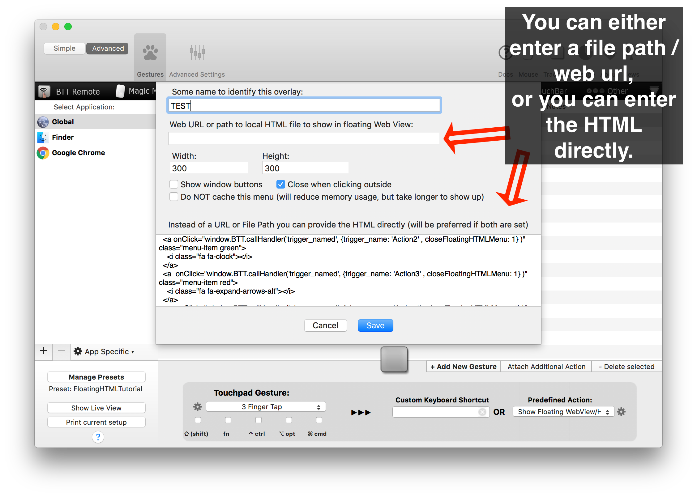
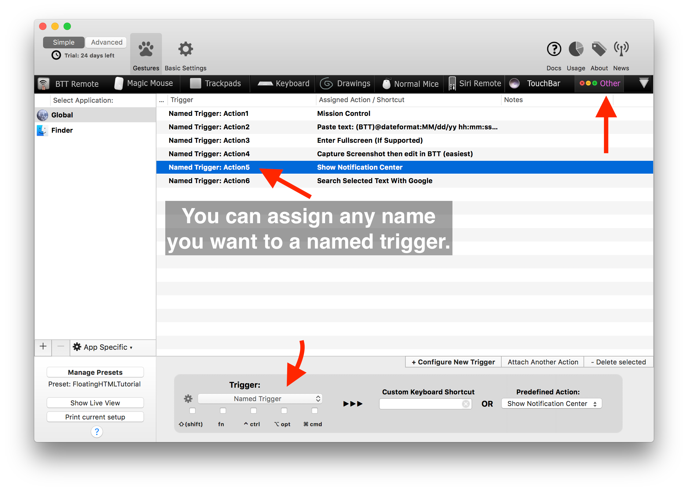
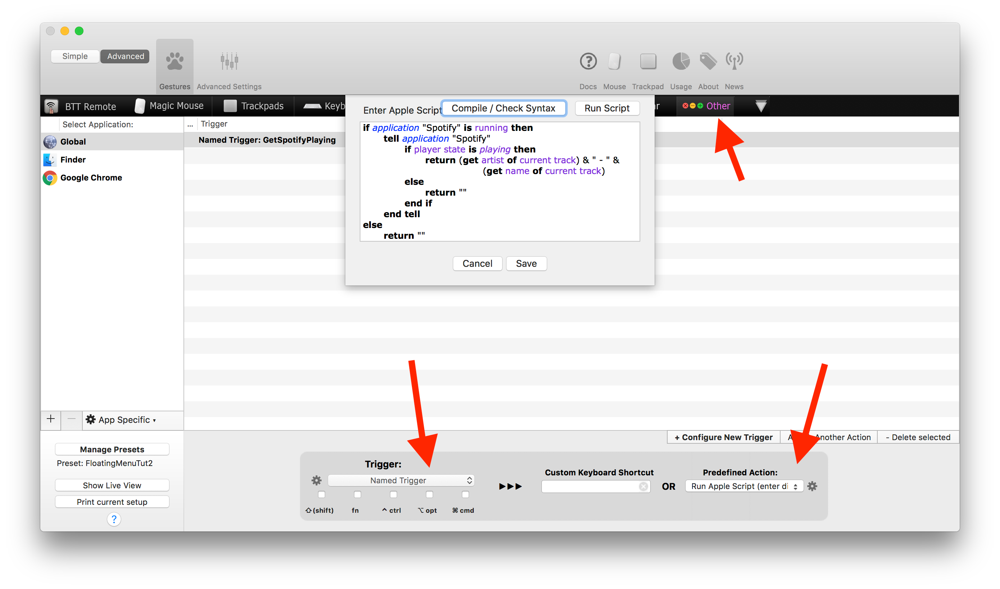
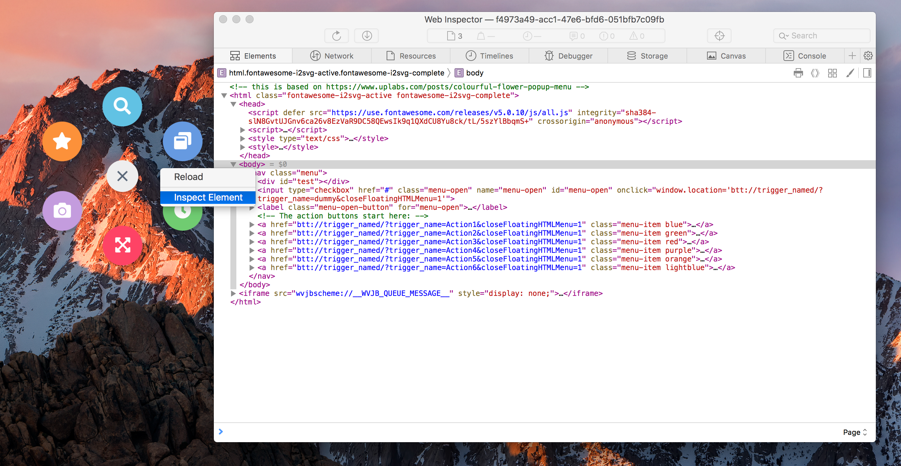

# Floating WebView/HTML Menu
This is a very recent feature which is only available in **versions greater than 2.463**. 


Using the predefined action "Show Floating WebView/HTML Menu" you can bring up a completely customizable overlay menu, which can control all of your BetterTouchTool actions. Basically it's just a web browser with transparent background, however combined with BTT it becomes super powerful.

Here is a quick example of how that could look like (if you want to try this yourself, see this tutorial: https://folivora.ai/blog/post/13000 
<video src="https://folivora.ai/folivora/blog-media/example.mp4" autoplay="" muted="" loop="" style="width:50%">
        Sorry, your browser doesn't support embedded videos, but don't worry, you can
        <a href="https://folivora.ai/folivora/blog-media/example.mp4">download it</a>
        and watch it with your favorite video player!
    </video>

*  [Setup](#setup)
*  [Available Settings](#settings)
*  [Triggering BetterTouchTool Actions](#triggering)
*  [Execute Java Script when opening](#jsonopen)
*  [Execute Java Script when closing](#jsonclose)
*  [Starter Template](#template)
*  [Tips](#tips)
*  [Example Menu](#example)


***
<a name="setup"></a>
## Setup

The setup is pretty simple. You assign the predefined action "Show Floating WebView/HTML Menu" to some trigger in BTT.
You enter the path or URL to the html file you want to show.



<a name="settings"></a>
## Available Settings

* Width & Height define how big the overlay will be.
* "*Show window buttons*" defines whether the red/orange/green window buttons are shown above the overlay menu.
* You can choose whether the menu should close when clicking outside or not.
* You can choose whether the menu should be cached or not. Caching is very useful if you want to access the menu regularly, as it will show up much faster.
* In the advanced tab you can select a custom user agent and define whether specific types of links should be opened in the system web browser.

***
<a name="triggering"></a>
## Triggering BetterTouchTool actions

There are multiple ways to trigger BetterTouchTool actions from the Floating Web View. 
I recommend to either use custom ```btt://```urls or to use the Java Script methods BTT provides. The rest of this document will focus on these two options.

In theory you can use all the scripting methods BTT provides (see [Scripting BetterTouchTool](scripting_btt.md)). However for most use cases the best option is to use the "Named Triggers" which can be configured in the "Other" tab in BTT.



### Triggering actions using btt:// links
The easiest way to trigger BetterTouchTool actions from within the Floating Web View is to use the custom btt:// links by assigning them to normal HTML ```<a>``` elements. Here is an example:

```HTML
<a href="btt://trigger_named/?trigger_name=Action1&closeFloatingHTMLMenu=1">Trigger Action1 via Link</a>  

```

When clicking this link it will do two things:
1. It will close the Floating Web View. This is because we added closeFloatingHTMLMenu=1 to the URL.
2. It will execute the Named Trigger with the name **Action1**.

You can do much more with custom btt:// links than just triggering Named Triggers. However this is quite advanced and most users won't need it. If you e.g. want to dynamically adjust parameters of BTT actions have a look at the details here: [Custom btt:// URL Scheme](custom_url_scheme.md)

#### Limitations when using btt:// links:
btt:// links don't have return values. This means for example if you have a fancy Apple Script configured in BTT which gets the currently playing song in Spotify, you won't be able to get that information using btt:// links. To do something like this, see the next part about how to trigger things using Java Script.

***

### Triggering actions using Java Script
BetterTouchTool automatically injects a little Java Script communication bridge into the HTML you provide. You can use this bridge to control BTT, trigger actions etc.

To see all methods available via this bridge, please have a look here: [Java Script Bride Overview](floating_menu_javascript.md)

Here is a simple example:

```HTML

  <div onClick="window.BTT.callHandler('trigger_named', {trigger_name: 'Action5' , closeFloatingHTMLMenu: 1} )" >
  </div>

```
As you can see I'm using a simple onClick handler on a default link tag (it could be any HTML element) to call a function on an element called BTT which is available on the window object.
The BTT element is automatically available after opening the floating menu and you can use it to call various BetterTouchTool functionality.

The most practical use in combination with the floating HTML menu is to call a named trigger (these can be configured in the "Other" tab in BTT.).  If you want to do more dynamic things, have a look here:  [Java Script Bride Overview](floating_menu_javascript.md)

**Advanced Tip:**
If your named trigger executes a Apple or Shell Script that returns a value, you get that return value by passing a callback function. This callback function will receive the result / return value of the script that is assigned to your Named Trigger. Here is a quick example that gets the currently playing song from Spotify:

```JavaScript
window.BTT.callHandler('trigger_named', 
    {
        //this will trigger the named trigger "SpotifyGetPlaying"
        trigger_name: 'SpotifyGetPlaying'
    },
    function callback(response) {   
        //this writes the result to an element with the id spotifyDiv
        document.getElementById('spotifyDiv').innerHTML = response;
    }
);
```
When configured like this the Java Script would execute the named trigger *SpotifyGetPlaying*. BetterTouchTool would then execute the assigned Apple Script and return the currently playing track in the callback function. You can then use that information in your Floating Web View however you like. This will allow you to build super powerful dashboards.





<a name="closing"></a>
## Closing the floating menu

In general you can always perform the same trigger you used to open the menu in order to close the menu. Additionally if you set the "close when clicking outside" option, you can just click outside of the Floating Web View to close it.

However if you want to close the menu in response to any of your menu items, include 
 ``` closeFloatingHTMLMenu: 1``` in your call. For example with Javas Script:
 ```HTML
  <div onClick="window.BTT.callHandler('trigger_named', {trigger_name: 'Action5', closeFloatingHTMLMenu: 1} )" >
  </div>

```

or using custom btt:// urls:

```HTML
<a href="btt://trigger_named/?trigger_name=Action1&closeFloatingHTMLMenu=1">Trigger Action1 via Link</a>  

```
 <a name="jsonopen"></a>
 ## Executing Java Script when the Menu opens

 BetterTouchTool automatically calls the ```BTTInitialize()``` method when showing the Floating Web View. You can put your custom code in that function.

  <a name="jsonclose"></a>
  ## Executing Java Script when the Menu closes

 BetterTouchTool automatically calls the ```BTTWillCloseWindow()``` method when the overlay is about to close, you can put your own code in that function.

 <a name="template"></a>
 ## Starter Template

Here is a little starter template you can use to create your own menu. There are tons of great CSS and HTML examples out there that you can use as a base to design your Floating Menu. BetterTouchTool should support all HTML, Java Script & CSS features that are available in Safari.
```HTML
<html>
<head>
  <script>
    // this function is called everyime you open the menu in BTT
    function BTTInitialize() {
     
    }
    // this function is called everytime you close the menu
    function BTTWillCloseWindow() {

    }
  </script>
  </head>

  <body>
    <!-- this uses the link technique to call a BTT trigger: -->
    <a href="btt://trigger_named/?trigger_name=Action1&closeFloatingHTMLMenu=1">Trigger via Link</a>  

    <!-- this uses the java script technique to call a BTT Trigger -->
    <div onClick="window.BTT.callHandler('trigger_named',
        {
            trigger_name: 'Action2',
            closeFloatingHTMLMenu: 1
        })">
        Test Trigger
    </div>
  </body>
  <style>
    body {
        background: clear;
    }
  </style>
  </html>

```

<a name="tips"></a>
## Tips for creating a menu

* Often CSS Grid is a good solution, as it makes it easy to position elements in a grid. However there are also tons of great HTML+CSS menus out there that you can use as a starting point.
* Test in a web browser first (just open your html file). It's easier to debug there.
* When testing in BTT you can right-click the web-view and choose "Inspect Element". This will open the Safari Dev Tools and you can edit/view the code.
* If you made a change after having the menu opened in BTT, you can right-click the menu and choose "reload". This only works if you use a url or file path, not when passing the HTML directly.
* Make sure to set the background of the body element to clear (```background-color:clear```)



<a name="example"></a>
## Example Menu

A nice example can be found in this tutorial: 
https://folivora.ai/blog/post/13000 

