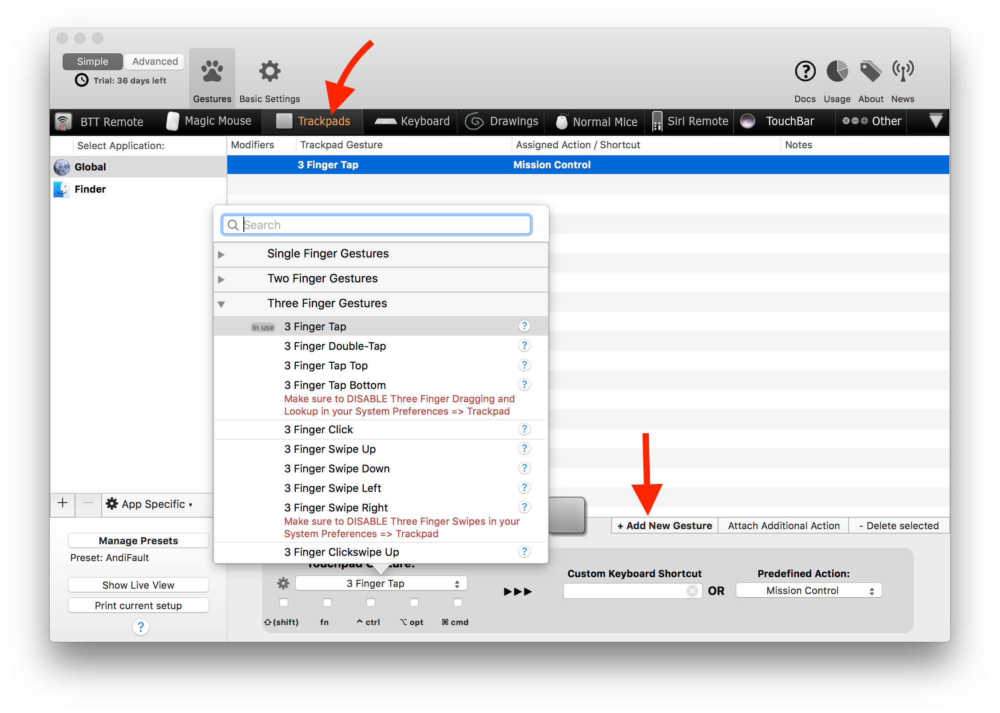
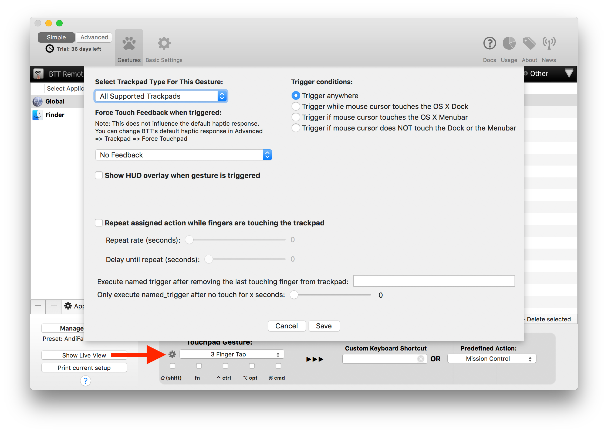
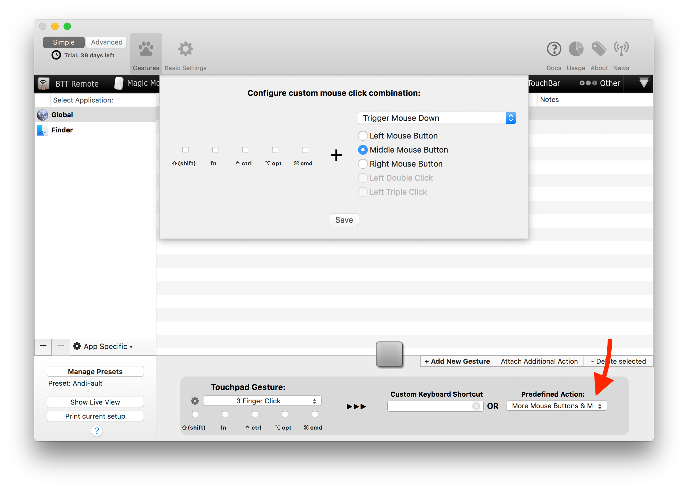
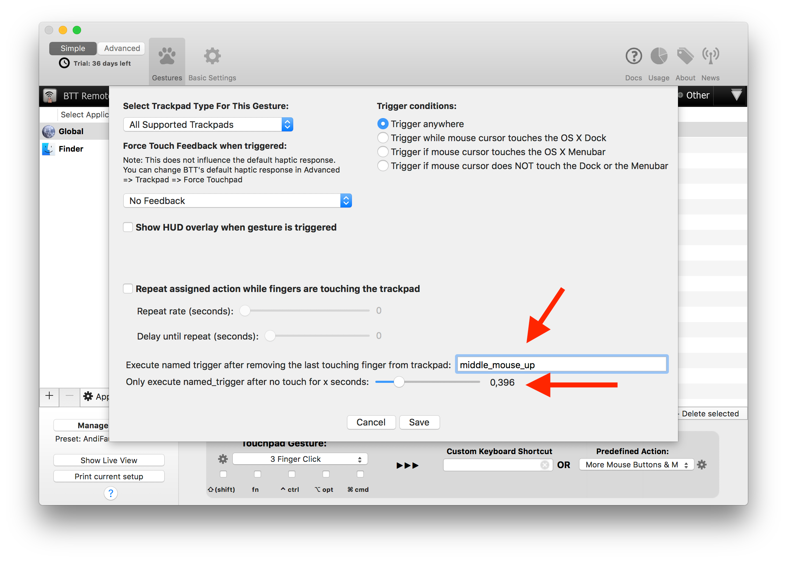
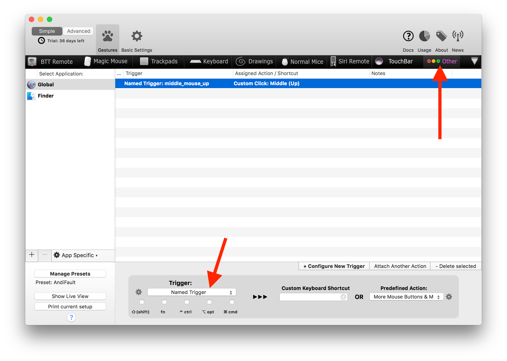

# Magic Mouse & Trackpad Gestures

BetterTouchTool currently supports the following touch devices:
* Magic Mouse
* Magic Mouse 2
* Magic Trackpad
* Magic Trackpad 2
* All multi-touch capable built-in Macbook Trackpads

You can configure many additional gestures for these devices.

In general the setup is pretty straight forward:
1. You select the device tab 
2. You click the "+Add New Gesture" button
3. You select the Gesture you want
4. You assign an action or keyboard shortcut to that gesture

## Advanced Gesture Configuration
There are some advanced settings you can make use of. They can be accessed by clicking the little cog icon on the left of the gesture selection button.

For example you can make the gesture trigger only on specific trackpad types, you can define a haptic feedback or make a HUD (similar to the macOS volume or brightness change indicators) show up when the gesture is triggered.

### Action Repeat While Touching
Starting in version 2.500 you can now also choose to repeat the assigned action as long as a finger is still touching the trackpad after the gesture has been triggered. This doesn't work with all gestures, because e.g. for Three Finger Taps you won't have any fingers touching the trackpad after the gesture has been triggered.

However it can be used e.g. for all click, tip tap and swipe gestures.

## Triggering a second action after removing the last touching finger
Starting in version 2.500 you can make a gesture trigger two different actions. The first one is the default action you assign to an action. It is triggered when the gesture is recognized. The second one however is a so called "Named Trigger".

If you set a Named Trigger in the advanced settings, it will be executed after you remove the last finger from the trackpad. E.g. if you do a three finger click the default trigger will execute right after the click. However you can still leave your fingers on the trackpad and e.g. move the mouse cursor. Then after you remove the last finger the named trigger will be executed.

This is very useful if you want to set up e.g. a middle click for CAD apps. You could use a three finger click to trigger a "Middle Mouse Down" and then a "Middle Mouse Up" after the last finger has left the trackpad / Magic Mouse surface. You can use the predefined action "More Mouse Buttons & Modifiers / Custom Click" to send separate down/up clicks.

Named Triggers can be configured in the "Other" Tab in BetterTouchTool.

**Middle Click Example:**

Here we configure the More Mouse Buttons & Modifiers action:

Here we configure the gesture to trigger a Named Trigger:

And here we configure the Named Trigger:

