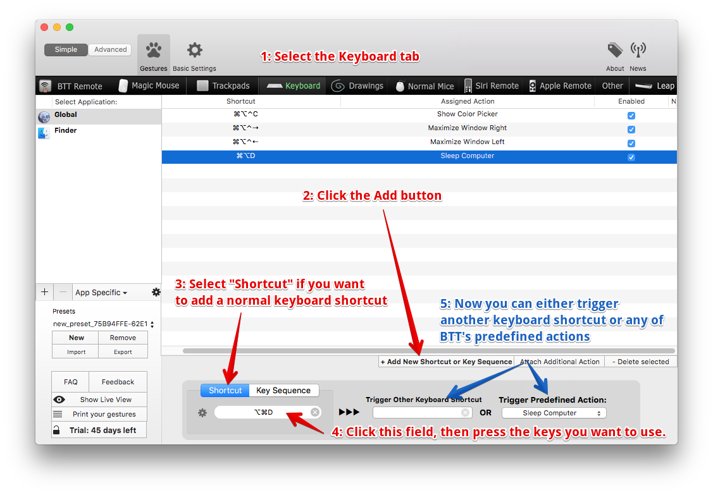

#Adding Normal Keyboard Shortcuts in BetterTouchTool

###Disable global shortcuts for specific apps
In some cases you may want to disable a shortcut you have set in the global category for a specific app. To do this you need to add this app to BetterTouchTool's app list, and then either assign the predefined action "Use apple default or do nothing" or alternatively 