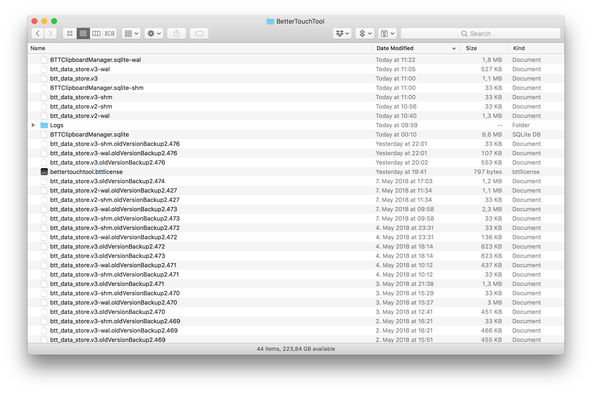

# Restoring Automatic Backups

There can be many reasons why you want to restore a backup of your BetterTouchTool settings. For example your current settings may have gotten corrupted for some reason (e.g. a hard drive or software issue), or you accidentall deleted some things you need back.

BetterTouchTool creates a backup of your settings everytime after it updates to a new version. 
These backups are located in ```~/Library/Application Support/BetterTouchTool```. To open this folder, go to Finder, then click "Go" and then click "Go To Folder". There you can enter the path to this folder (make sure to include the ~).

Now what you see may look similar to this:



I recommend to sort it by "Date Modified", so you can see which are the newest items in that folder.

The BetterTouchTool data store always consists of three files:
* btt_data_store.v2
* btt_data_store.v2-shm
* btt_data_store.v2-wal

Instead of v2 it can also be v3 in the new versions.

Now you can see that there are many files that have a suffix called ".oldVersionBackupXXXX". These are the backups that BTT has saved automatically.

To restore such a backup, follow these steps:

1. Make a backup of the whole ```~/Library/Application Support/BetterTouchTool``` folder so in case you break anything you can restore it later (just copy it somewhere)
2. Quit BetterTouchTool
3. Delete or rename the 3 files mentioned above. (if there are v3 files you need to delete them, if there are also v2 files you should delete them too)
4. Look for the three backup files you want to restore. For example:
    * btt_data_store.v2.oldVersionBackup2.469
    * btt_data_store.v2-shm.oldVersionBackup2.469
    * btt_data_store.v2-wal.oldVersionBackup2.469
5. Rename these three files and remove the .oldVersionBackupXXXX suffix.
6. Start BetterTouchTool again.

Now your settings should have been restored. Make sure to select the correct device tab in BetterTouchTool (e.g. Magic Mouse)
