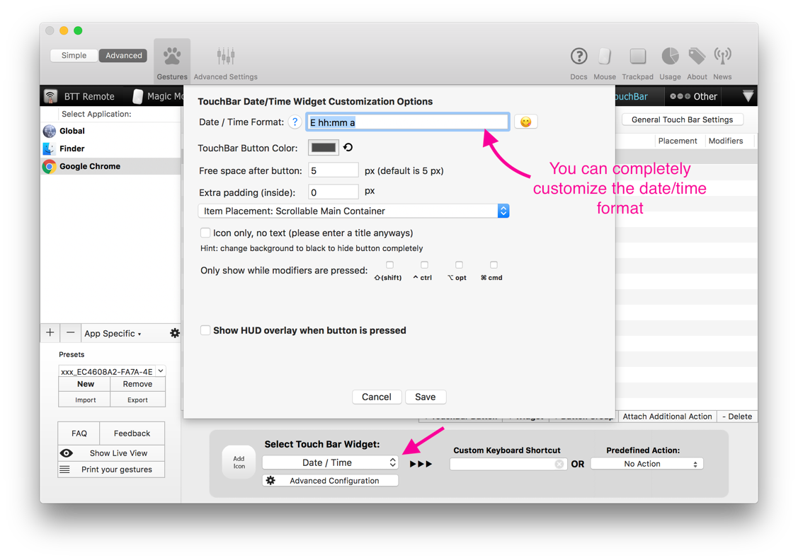
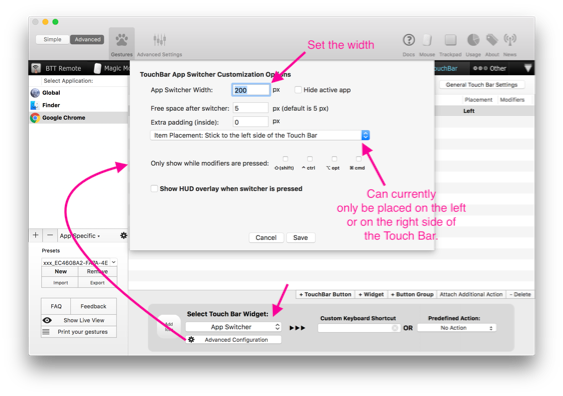
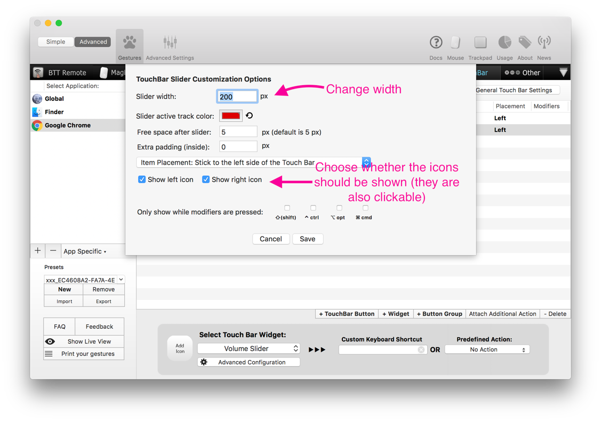
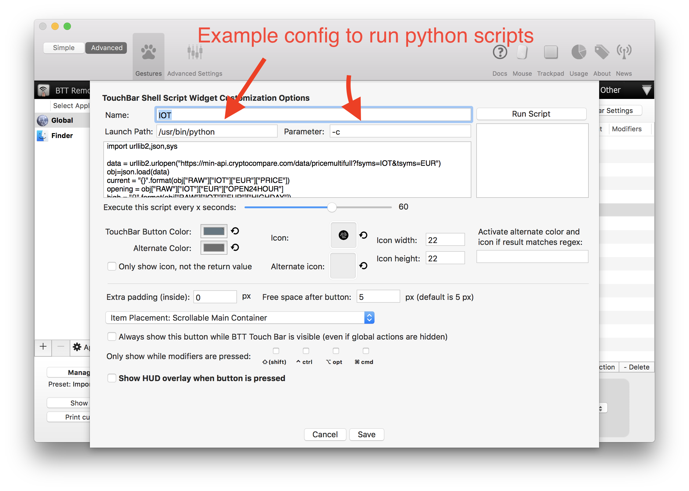
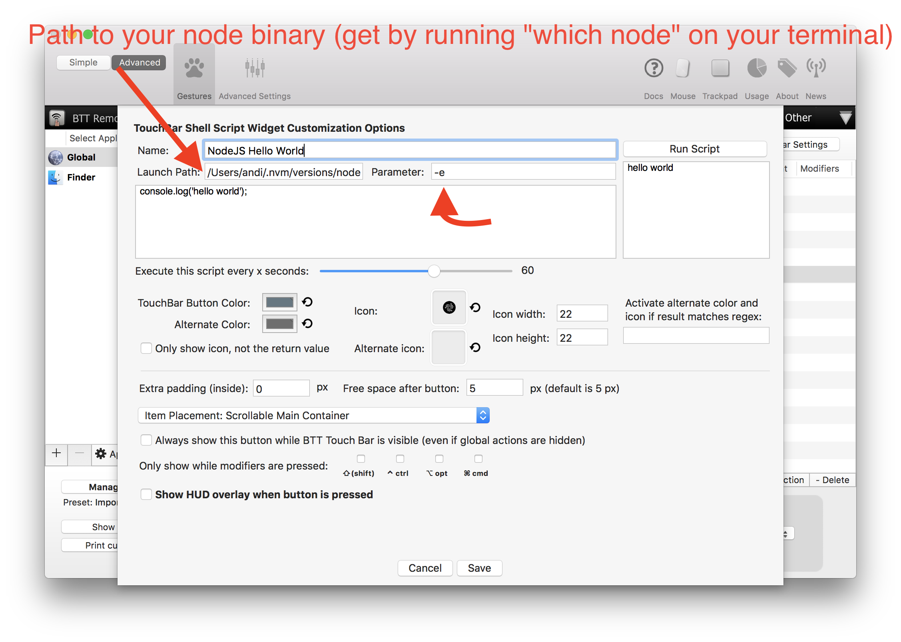
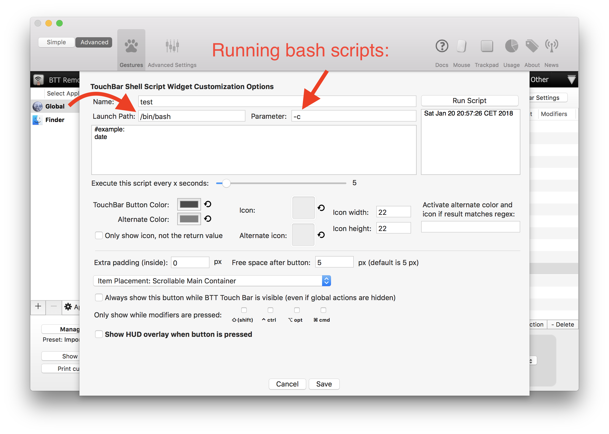
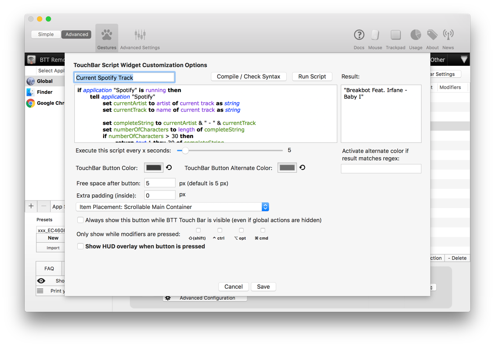
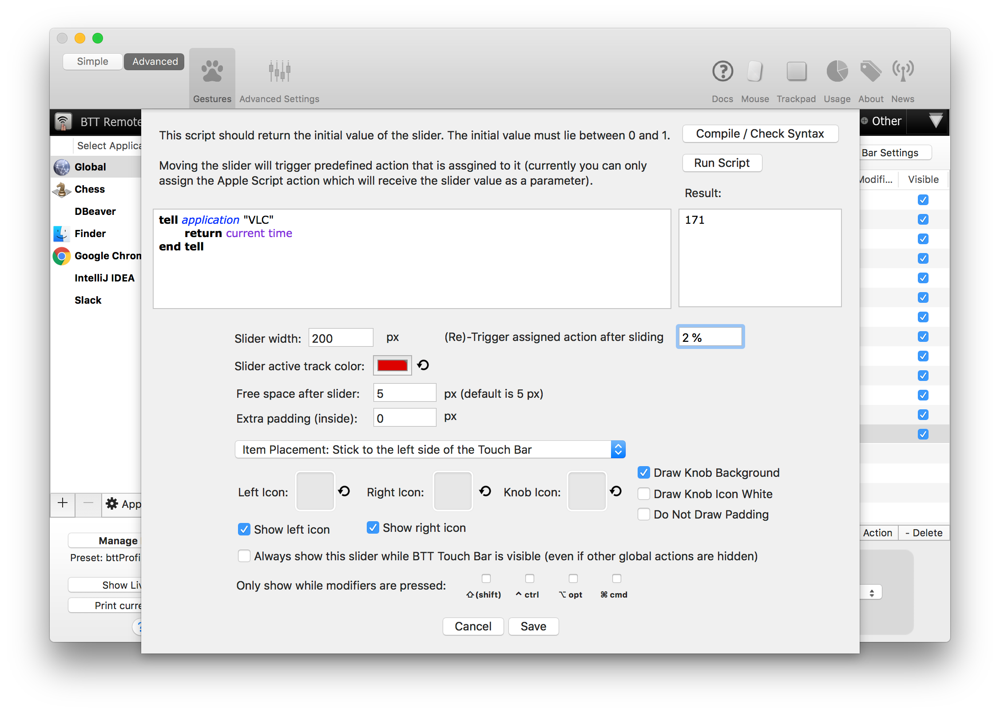
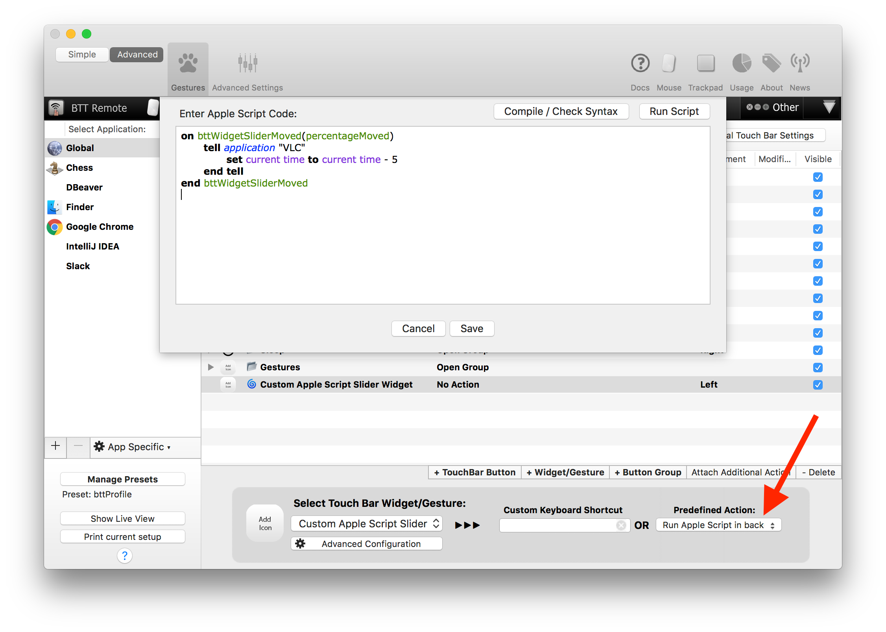

# Touch Bar Widgets
BetterTouchTool includes some widgets you can display on your Touch Bar.

**Hint:** It is often useful to put the widgets inside a Touch Bar Group
## Remaining Battery Widgets
This Widget allows you to view the estimated remaining time your Macbook Pro can run on the current battery charge.


## Date / Time Widget
Shows the current date/time in any format you want.



## App Switcher Widgets
Allows you to switch through your recent applications (like pressing cmd+tab)



## Volume Slider
Adjust the Mac speaker volume using a slider


## Brightness Slider
Adjust the Mac's brightness using a slider. 

**If you press ctrl while sliding it will change the brightness of your external monitors**


## Shell Script / Node / Python / ... Script Widget
The shell script widget allows you to run arbitrary shell scripts / tasks. This can easily be used to run python scripts, node scripts etc..

**Note**: Chris Lennon created a really great webapp to automatically generate shell script widgets that can show you your favorite crypto currencies. It is available here: https://chrislennon.github.io/Crypto-Touchbar-App/






## Apple Script Widget
Allows you to run aribtrary Apple Script in a customizable time interval and display the result in the Touch Bar.

This is a very powerful widget, one example is the ability to show the currently playing Spotify Song (see [https://github.com/fifafu/BetterTouchTool/issues/308](https://github.com/fifafu/BetterTouchTool/issues/308))



## Emoji Widget
Allows you to insert emoticons from your Touch Bar in any app. 

Switch between the different groups of emoji using the arrow buttons.
The first group that is shown displays the most recently used emoji.


## Custom Apple Script Slider Widget
The custom Apple Script slider allows you to trigger custom things everytime the slider is dragged. 

You can set a script which returns the initial value of the slider like this:


Then you can assign the predefined action "Run Apple Script in Background". In that you need to define a function called ```bttWidgetSliderMoved```

For example like this (this will set the current position in VLC using the slider value)

```AppleScript
on bttWidgetSliderMoved(newSliderValue)
	tell application "VLC"
		set current time to (duration of current item * newSliderValue)
	end tell
end bttWidgetSliderMoved
```

Or like this (sets the system volume):
```AppleScript
on bttWidgetSliderMoved(sliderValue)
    set volume output volume sliderValue * 100
end bttWidgetSliderMoved
```


