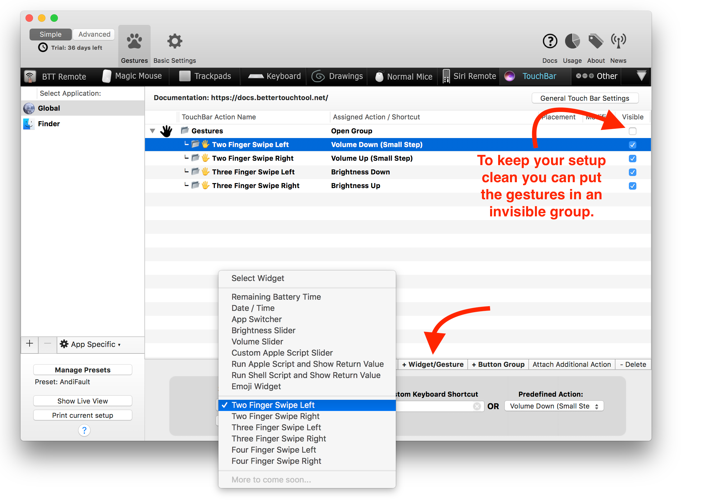
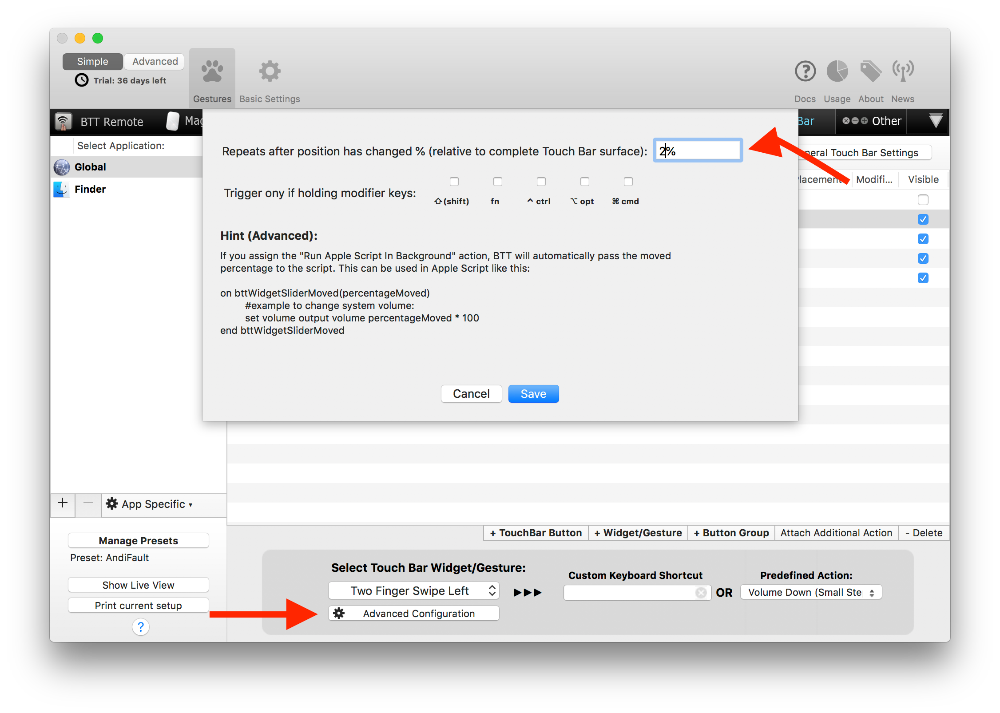

# Touch Bar Gestures

BetterTouchTool >= 2.500 supports a few Touch Bar Gestures.

* Two Finger Swipe Left / Right
* Three Finger Swipe Left / Right
* Four Finger Swipe Left / Right

These gestures are perfect for adjusting volume or brightness and can save you some space on the Touch Bar by replacing the sliders.

They are very easy to set up. Just click the "+Widget/Gesture" button and select the gesture you want to use. Then assign the action you want to use (e.g. volume up/down).



In the advanced settings you can select how often the gesture should trigger:




## Advanced: Passing the slided value to an Apple Script

If you assign the "Run Apple Script in Background" action to a Touch Bar gesture, it will automatically receive the percentage that has been slided in a specific direction.

Your Apple Script needs to look like this: (values 0 - 1, to get the real percentage multiply it by 100)

```AppleScript
on bttWidgetSliderMoved(percentageMoved)
	#example to change system volume:
	set volume output volume percentageMoved * 100
end bttWidgetSliderMoved
```